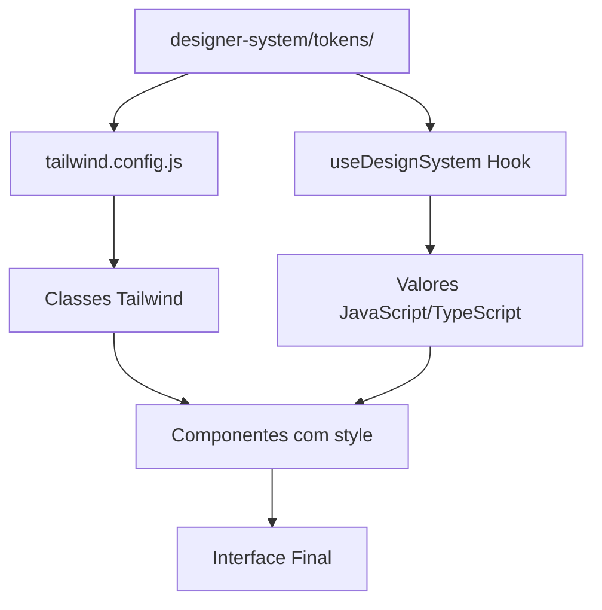

# 🎨 Projeto Origem

## 📋 Índice
- [👋 Introdução](#-introdução)
- [✨ Destaques](#-destaques)
- [🚀 Começando](#-começando)
- [🔐 Configuração do Supabase](#-configuração-do-supabase)
- [🚀 Deploy](#-deploy)
- [📱 Executando o Projeto](#-executando-o-projeto)
- [🎯 Estrutura de Navegação](#-estrutura-de-navegação)
- [🎨 Design System](#-design-system)
- [📦 Componentes Principais](#-componentes-principais)
- [📁 Estrutura do Projeto](#-estrutura-do-projeto)
- [💻 Desenvolvimento](#-desenvolvimento)
- [🔄 Renomeando o Projeto](#-renomeando-o-projeto)
- [🤝 Suporte](#-suporte)

## 👋 Introdução

Bem-vindo ao Projeto Origem! Este é um template moderno e flexível para criar aplicações incríveis que funcionam tanto na web quanto em dispositivos móveis. Nosso objetivo é tornar o desenvolvimento mais fácil e divertido, fornecendo uma base sólida com as melhores práticas já implementadas.

## ✨ Destaques

- 🌓 **Design System Completo** (modo claro e escuro automático)
- 📱 **Design Responsivo** (funciona em qualquer tela)
- 🎯 **Componentes Reutilizáveis** (prontos para usar)
- 🖌️ **Tailwind + Tokens Unificados** (duas formas de estilizar)
- 🌐 **Suporte Web e Mobile Nativo** 
- 🚀 **Deploy Simplificado**
- ⚡ **NativeWind 4.x** (Tailwind para React Native)
- 🎨 **Design System Dinâmico** (tokens atualizados em tempo real)

## 🚀 Começando

### 📋 Pré-requisitos

Antes de começar, você precisa ter instalado em sua máquina:

1. [Git](https://git-scm.com) - Para baixar e versionar o projeto
2. [Node.js](https://nodejs.org/) - Use a versão LTS
3. [npm](https://www.npmjs.com/) - Vem junto com o Node.js
4. [Expo CLI](https://docs.expo.dev/workflow/expo-cli/) - Para desenvolvimento mobile

> 💡 **Dica**: Verifique se já tem algo instalado usando estes comandos:
> ```bash
> git --version
> node --version
> npm --version
> gh --version  # Verifica se o GitHub CLI está instalado
> gh auth status  # Verifica se está logado no GitHub CLI
> ```
>
> 🔑 **Configurando GitHub CLI**:
> Se não estiver logado no GitHub CLI, siga estes passos:
> 1. Execute `gh auth login`
> 2. Selecione "GitHub.com"
> 3. Escolha "HTTPS" como protocolo
> 4. Confirme com "Yes" para autenticar via web browser
> 5. O browser abrirá automaticamente para você fazer login
> 6. Após o login, copie o código mostrado no terminal e cole no browser
> 7. Pronto! Você está logado e pode criar PRs via terminal

### 🎮 Configuração Inicial

1. **Clone o Projeto**
   ```bash
   git clone [url-do-repositório]
   cd [nome-do-projeto]
   ```

2. **Instale as Dependências**
   ```bash
   npm install
   ```

3. **Instale o Expo CLI**
   ```bash
   npm install -g expo-cli
   ```

## 🔐 Configuração do Supabase

### 🎯 Passo a Passo

1. **Crie o Arquivo de Ambiente**
   ```bash
   # Mac/Linux
   touch .env
   # Windows
   type nul > .env
   ```

2. **Configure as Variáveis**
   - Copie o conteúdo de `.env.example` para `.env`
   ```bash
   cp .env.example .env
   ```

3. **Obtenha suas Credenciais**
   1. Acesse [supabase.com](https://supabase.com)
   2. Crie uma conta ou faça login
   3. Crie um novo projeto
   4. Vá em "Settings" > "API"
   5. Copie:
      - Project URL → Cole em `EXPO_PUBLIC_SUPABASE_URL`
      - anon public → Cole em `EXPO_PUBLIC_SUPABASE_ANON_KEY`

## 🚀 Deploy

### 💡 Configuração na Vercel

1. Acesse [vercel.com](https://vercel.com)
2. Vá em seu projeto
3. Clique em "Settings" > "Environment Variables"
4. Adicione cada variável separadamente:

   **Primeira Variável:**
   - Key: `EXPO_PUBLIC_SUPABASE_URL`
   - Value: sua_url_do_supabase (exemplo: https://seu-projeto.supabase.co)

   **Segunda Variável:**
   - Key: `EXPO_PUBLIC_SUPABASE_ANON_KEY`
   - Value: sua_chave_anonima_do_supabase

   > 💡 **Dica**: Você verá dois campos separados para cada variável: um para a "Key" (nome da variável) e outro para o "Value" (valor da variável)

> ⚠️ **Importante**: Use EXATAMENTE estes nomes de variáveis e mantenha suas credenciais seguras!

### 🎯 Por que a Vercel?

- ✨ Padrão da Indústria
- 🚀 Performance Excepcional
- 🎁 Plano Gratuito Generoso
- 🔒 Segurança de Primeira
- 🎯 Deploy Automático
- 📊 Analytics Incluído

## 📱 Executando o Projeto

Para iniciar o projeto em qualquer sistema operacional (Windows, macOS ou Linux), use o comando:

```bash
npm start
```

Este comando irá:
1. ✅ Verificar automaticamente se as dependências estão instaladas
2. 📦 Instalar as dependências caso necessário
3. 🚀 Iniciar o Expo em modo de desenvolvimento

> 💡 **Dicas para Windows**:
> - O comando `npm start` funciona perfeitamente no Windows
> - Use o Windows Terminal ou PowerShell para melhor experiência
> - Se encontrar algum erro de permissão:
>   1. Execute o PowerShell como administrador
>   2. Execute o comando: `Set-ExecutionPolicy RemoteSigned`
>   3. Tente `npm start` novamente
> - Certifique-se de ter o Node.js instalado corretamente no Windows

> 💡 **Dica**: Este é o comando recomendado para iniciar o projeto, pois ele garante que todas as dependências estejam corretamente instaladas antes de iniciar.

Alternativamente, se você precisar iniciar o projeto para uma plataforma específica, pode usar:

```bash
# Web (Windows, macOS, Linux)
npm run web

# iOS (apenas em macOS)
npm run ios

# Android (Windows, macOS, Linux)
npm run android
```

> ⚠️ **Notas importantes**:
> - O comando `npm run ios` só está disponível em computadores macOS, pois requer o Xcode instalado
> - Para rodar no Android, você precisa ter o Android Studio instalado e configurado em qualquer sistema operacional

## 🎯 Estrutura de Navegação

### 🔄 Rotas Principais

1. **Usuários Não Logados**
   - Padrão: `/(auth)/login`
   - Para alterar, edite `app/index.tsx`:
   ```typescript
   import { Redirect } from 'expo-router';
   
   export default function Index() {
     return <Redirect href="/(auth)/sua-nova-rota" />;
   }
   ```
   > 💡 **Dica**: Crie o arquivo correspondente em `app/(auth)/sua-nova-rota.tsx`

2. **Usuários Logados**
   - Padrão: `/(tabs)/home` (nossa tela inicial após login)
   - Para alterar, edite `contexts/auth.tsx`

### 📱 Fluxo de Autenticação
- Login: `/(auth)/login`
- Cadastro: `/(auth)/signup`
- Home após login: `/(tabs)/home`

### 🔐 Rotas Protegidas

O projeto utiliza o componente `ProtectedRoute` para controlar o acesso às rotas que necessitam de autenticação.

#### Como funciona:
- Rotas protegidas: Precisam de autenticação para serem acessadas
- Rotas públicas: Podem ser acessadas sem autenticação

#### Uso:
1. **Para proteger uma rota**:
```tsx
import { ProtectedRoute } from '../components/ProtectedRoute';

export default function SuaRotaProtegida() {
  return (
    <ProtectedRoute>
      {/* Seu conteúdo aqui */}
    </ProtectedRoute>
  );
}
```

2. **Para uma rota pública**:
```tsx
export default function SuaRotaPublica() {
  return (
    // Não precisa do ProtectedRoute
    <View>
      {/* Seu conteúdo aqui */}
    </View>
  );
}
```

> 💡 **Dica**: Use o ProtectedRoute apenas nas rotas que realmente precisam de autenticação. Rotas como login, cadastro e recuperação de senha devem ser públicas.

#### Comportamento:
- Se o usuário não estiver autenticado e tentar acessar uma rota protegida:
  - Será redirecionado automaticamente para a tela de login
  - Após fazer login, será redirecionado de volta para a rota que tentou acessar
- Se o usuário estiver autenticado:
  - Terá acesso normal à rota protegida
  - Poderá navegar livremente entre rotas protegidas

## 🎨 Design System

O projeto utiliza um **sistema de design completo e inovador** que combina o melhor de duas abordagens: **Tailwind CSS** para agilidade e **Tokens dinâmicos** para personalização avançada.

### 🏗️ **Arquitetura do Design System**



### 📁 **Estrutura dos Tokens**

```
designer-system/
├── index.ts              # Exportações centralizadas
└── tokens/
    ├── colors.ts         # 🎨 Todas as cores (light/dark)
    ├── spacing.ts        # 📏 Espaçamentos consistentes
    ├── typography.ts     # 🔤 Fontes e tamanhos
    ├── borders.ts        # 🔲 Border radius
    ├── effects.ts        # ✨ Sombras, opacidade, etc.
    └── breakpoints.ts    # 📱 Responsividade
```

### 🎯 **Como Usar o Design System**

O projeto oferece **duas formas** de aplicar estilos, ambas sincronizadas automaticamente:

#### **1. 📝 Via Classes Tailwind (Recomendado para rapidez)**
```tsx
<View className="bg-primary-light p-md rounded-lg shadow-card">
  <Text className="text-headline-lg font-jakarta-bold text-primary-dark">
    Título
  </Text>
  <Text className="text-body-md text-text-secondary-light mt-sm">
    Descrição do conteúdo
  </Text>
</View>
```

#### **2. ⚙️ Via Hook useDesignSystem (Recomendado para lógica dinâmica)**
```tsx
import { useDesignSystem } from '@/hooks/DesignSystemContext';

function MeuComponente() {
  const { colors, spacing, fontSize, isDark } = useDesignSystem();
  
  return (
    <View style={{
      backgroundColor: colors['primary-light'],
      padding: spacing.md,
      borderRadius: spacing.sm
    }}>
      <Text style={{
        fontSize: fontSize['headline-lg'].size,
        color: colors['text-primary-light']
      }}>
        Título Dinâmico
      </Text>
    </View>
  );
}
```

#### **3. 🔄 Híbrido (Melhor dos dois mundos)**
```tsx
function ComponenteInteligente() {
  const { isDark } = useDesignSystem();
  
  return (
    <View className={`p-lg rounded-xl ${
      isDark ? 'bg-bg-primary-dark' : 'bg-bg-primary-light'
    }`}>
      <Text className="text-headline-md font-jakarta-bold">
        Texto que adapta ao tema
      </Text>
    </View>
  );
}
```

### 🎨 **Tema Claro/Escuro Automático**

O sistema de tema é **completamente automático** e oferece três modos:

```tsx
const { themeMode, currentTheme, setThemeMode, isDark } = useDesignSystem();

// Modos disponíveis:
setThemeMode('light');   // ☀️ Força tema claro
setThemeMode('dark');    // 🌙 Força tema escuro  
setThemeMode('system');  // 🔄 Segue o sistema (padrão)

// Helpers úteis:
isDark   // boolean - true se estiver no modo escuro
isLight  // boolean - true se estiver no modo claro
isSystem // boolean - true se estiver seguindo o sistema
```

### 🔧 **Personalizando o Design System**

Para alterar qualquer aspecto visual do projeto:

#### **1. 🎨 Alterando Cores**
Edite `designer-system/tokens/colors.ts`:
```typescript
export const colors = {
  // Cores primárias
  'primary-light': '#0a7ea4',    // Sua nova cor primária clara
  'primary-dark': '#4A90E2',     // Sua nova cor primária escura
  
  // Backgrounds
  'bg-primary-light': '#FFFFFF', // Fundo principal claro
  'bg-primary-dark': '#1C1E26',  // Fundo principal escuro
  
  // Textos
  'text-primary-light': '#11181C', // Texto principal claro
  'text-primary-dark': '#ECEDEE',  // Texto principal escuro
  // ... mais cores
};
```

#### **2. 📏 Alterando Espaçamentos**
Edite `designer-system/tokens/spacing.ts`:
```typescript
export const spacing = {
  'xs': '8px',    // Espaçamento extra pequeno
  'sm': '12px',   // Espaçamento pequeno
  'md': '16px',   // Espaçamento médio
  'lg': '24px',   // Espaçamento grande
  'xl': '32px',   // Espaçamento extra grande
  // ... mais espaçamentos
};
```

#### **3. 🔤 Alterando Tipografia**
Edite `designer-system/tokens/typography.ts`:
```typescript
export const fontSize = {
  'headline-lg': {
    size: '32px',
    lineHeight: '40px',
    fontWeight: '700'
  },
  'body-md': {
    size: '16px',
    lineHeight: '24px',
    fontWeight: '400'
  },
  // ... mais tamanhos
};
```

### ⚡ **Mudanças Instantâneas**

Quando você altera qualquer token em `designer-system/tokens/`:

✅ **Classes Tailwind** são atualizadas automaticamente  
✅ **Hook useDesignSystem** reflete as mudanças  
✅ **Todos os componentes** são atualizados  
✅ **Hot reload** funciona perfeitamente  

### 🎯 **Tokens Disponíveis**

| Token | Descrição | Exemplo de Uso |
|-------|-----------|----------------|
| `colors` | Todas as cores do sistema | `bg-primary-light`, `colors['primary-light']` |
| `spacing` | Espaçamentos consistentes | `p-md`, `spacing.md` |
| `fontSize` | Tamanhos e pesos de fonte | `text-headline-lg`, `fontSize['headline-lg']` |
| `borderRadius` | Bordas arredondadas | `rounded-lg`, `borderRadius.lg` |
| `boxShadow` | Sombras padronizadas | `shadow-card`, `boxShadow['card']` |
| `breakpoints` | Pontos de quebra responsivos | `md:flex-row`, `breakpoints.md` |

### 🔍 **Visualizando o Design System**

Para ver todos os tokens em ação, acesse a tela de desenvolvimento:
- **Web**: `http://localhost:8081/(tabs)/dev`
- **Mobile**: Navegue para a aba "Dev" no app

Esta tela mostra:
- 🎨 Todas as cores em tempo real
- 📏 Exemplos de espaçamento
- 🔤 Tipografia completa
- ✨ Sombras e efeitos
- 📱 Breakpoints responsivos
- 🧩 Componentes do sistema

### 🔄 **Compatibilidade**

Para manter compatibilidade com códigos antigos, mantemos os aliases:

```tsx
// ✅ Novo (recomendado)
import { useDesignSystem } from '@/hooks/DesignSystemContext';
const theme = useDesignSystem();

// ✅ Antigo (ainda funciona)
import { useTheme } from '@/hooks/DesignSystemContext';
const theme = useTheme(); // Aponta para useDesignSystem
```

### 📱 **Responsividade Inteligente**

O sistema inclui breakpoints inteligentes que se adaptam automaticamente:

```tsx
// Classes responsivas
<View className="flex-col md:flex-row lg:grid lg:grid-cols-3">
  <Text className="text-body-sm md:text-body-md lg:text-headline-sm">
    Texto que cresce com a tela
  </Text>
</View>

// Via hook
const { currentBreakpoint, isMobile, isTablet, isDesktop } = useDesignSystem();
```

### 🎨 **Cores do Sistema e NativeWind**

O projeto utiliza o NativeWind (Tailwind para React Native) para estilização. As definições de cores, espaçamento, tipografia e sombras estão no arquivo `tailwind.config.js`, mas são **importadas automaticamente** dos tokens do Design System.

**⚠️ Importante**: Nunca edite o `tailwind.config.js` diretamente. Sempre altere os tokens em `designer-system/tokens/` para garantir sincronização.

### 🔤 **Configuração de Fontes**

O projeto oferece duas formas de configurar fontes:

#### **1. 🌐 Fontes via Expo Google Fonts (Recomendado)**
```bash
# Instalar uma nova fonte do Google Fonts
npx expo install @expo-google-fonts/nome-da-fonte
```

Configuração no `app/_layout.tsx`:
```tsx
import { useFonts, 
  PlusJakartaSans_200ExtraLight,
  PlusJakartaSans_400Regular,
  PlusJakartaSans_700Bold 
} from '@expo-google-fonts/plus-jakarta-sans';

const [fontsLoaded] = useFonts({
  PlusJakartaSans_200ExtraLight,
  PlusJakartaSans_400Regular,
  PlusJakartaSans_700Bold,
});
```

#### **2. 📁 Fontes Personalizadas**
1. Adicione arquivos `.ttf` ou `.otf` em `assets/fonts/`
2. Configure no `designer-system/tokens/typography.ts`
3. O sistema sincroniza automaticamente com o Tailwind

### 📈 **SEO e Meta Tags**

Configure SEO editando `app/head.tsx`:
```tsx
<title>Seu Título Aqui</title>
<meta name="description" content="Sua descrição aqui" />
<meta property="og:title" content="Título para compartilhamento" />
<meta property="og:image" content="https://seu-site.com/imagem.jpg" />
```

Arquivos importantes em `assets/seo-web/`:
- `robots.txt` - Controle de bots de busca
- `sitemap.xml` - Mapa do site
- `site.webmanifest` - Configurações PWA

## 📦 Componentes Principais

### 🔔 **Toast Notifications**
```tsx
import { useToast } from '@/hooks/useToast';

const { showToast } = useToast();

// Toast básico
showToast({
  type: 'success', // 'success' | 'warning' | 'error' | 'info'
  message: 'Operação realizada com sucesso!',
  description: 'Seus dados foram salvos', // Opcional
  position: 'top', // Opcional
  duration: 5000, // Opcional
});
```

### 🎯 **Usando o Design System nos Componentes**
```tsx
import { useDesignSystem } from '@/hooks/DesignSystemContext';

function MeuComponente() {
  const { colors, spacing, isDark } = useDesignSystem();
  
  return (
    <View className={`p-md rounded-lg ${
      isDark ? 'bg-bg-secondary-dark' : 'bg-bg-secondary-light'
    }`}>
      <Text className="text-headline-md font-jakarta-bold">
        Componente com Design System
      </Text>
    </View>
  );
}
```

### 🎨 **Theme Selector Component**
```tsx
import { ThemeSelector } from '@/components/AicrusComponents/theme-selector/ThemeSelector';

// Seletor simples
<ThemeSelector size="md" variant="default" />

// Seletor minimalista
<ThemeSelector size="sm" variant="minimal" iconOnly />

// Botão único para alternar
<ThemeSelector variant="single" transparentSingle />
```

## 📁 Estrutura do Projeto

```
📱 Estrutura Principal
/.expo              # Configurações do Expo
/app                # Páginas e rotas da aplicação
  /(auth)           # Rotas de autenticação
    /_layout.tsx    # Layout das telas de auth
    /login.tsx      # Tela de login
    /register.tsx   # Tela de registro
  /(tabs)           # Rotas autenticadas
    /_layout.tsx    # Layout das tabs
    /home.tsx       # Home (tela inicial)
    /dev.tsx        # Ferramentas de desenvolvimento e Design System
  /+not-found.tsx   # Página 404
  /_layout.tsx      # Layout raiz da aplicação
  /head.tsx         # Configurações de SEO e meta tags

🎨 Design System e Componentes
/designer-system    # 🚀 SISTEMA DE DESIGN UNIFICADO
  /index.ts         # Exportações centralizadas
  /tokens/          # Tokens do design system
    /colors.ts      # 🎨 Todas as cores (light/dark)
    /spacing.ts     # 📏 Espaçamentos consistentes  
    /typography.ts  # 🔤 Fontes e tamanhos
    /borders.ts     # 🔲 Border radius
    /effects.ts     # ✨ Sombras, opacidade, etc.
    /breakpoints.ts # 📱 Responsividade

/components        # Componentes reutilizáveis
  /AicrusComponents/ # Biblioteca de componentes
    /accordion/    # Componente Accordion
    /button/       # Componente Button
    /input/        # Componentes de Input
    /toast/        # Sistema de notificações
    /theme-selector/ # Seletor de tema
    # ... mais componentes
  /ProtectedRoute.tsx # Proteção de rotas

/hooks             # Hooks personalizados
  /DesignSystemContext.tsx # 🎯 HOOK PRINCIPAL (useDesignSystem)
  /useToast.tsx    # Hook para notificações
  /useResponsive.tsx # Hook para responsividade

🎨 Assets e Recursos
/assets            # Recursos estáticos
  /images         # Imagens e ícones
  /fonts          # Fontes personalizadas (se necessário)
  /seo-web        # Arquivos de SEO e configurações para web

/contexts         # Contextos do React
  /auth.tsx       # Contexto de autenticação

/lib              # Bibliotecas e utilitários
  /supabase.ts    # Configuração do Supabase
  /polyfills.ts   # Polyfills para compatibilidade

/types            # Definições de tipos TypeScript

🛠️ Configuração
/.env             # Variáveis de ambiente
/.env.example     # Exemplo de variáveis de ambiente
/tailwind.config.js # 🔄 Configuração Tailwind (sincronizado com tokens)
/postcss.config.js # Configuração PostCSS
/package.json     # Dependências e scripts
/tsconfig.json    # Configuração do TypeScript
/metro.config.js  # Configuração Metro Bundler
/global.css       # Estilos globais NativeWind
```

## 💻 Desenvolvimento

### 📤 Git e GitHub

**Primeira vez?**
```bash
git remote add origin [URL_DO_SEU_REPOSITÓRIO]
git branch -M main
git push -u origin main
```

**Commits diários**
```bash
git add .
git commit -m "Explique o que você mudou"
git push
```

### 🎯 Checklist para Novos Componentes

1. [ ] Usar imports corretos do Design System
2. [ ] Implementar suporte a tema claro/escuro
3. [ ] Usar tipografia responsiva
4. [ ] Considerar os três breakpoints
5. [ ] Usar espaçamentos do Design System
6. [ ] Usar cores do tema atual
7. [ ] Implementar animações suaves (quando necessário)

## 🔄 Renomeando o Projeto

Se você deseja usar este projeto como base e mudar seu nome, siga estes passos para evitar erros:

### 📋 Passo a Passo para Renomear

1. **Renomeie a pasta do projeto**
   ```bash
   # Fora do diretório do projeto
   mv projeto-origem seu-novo-nome
   cd seu-novo-nome
   ```

2. **Limpe o cache e reinstale dependências**
   ```bash
   # Limpe completamente tudo para evitar referências ao nome antigo
   rm -rf node_modules
   rm -rf .expo
   npm cache clean --force
   
   # Reinstale as dependências
   npm install
   ```

3. **Atualize o arquivo package.json**
   Edite o arquivo e mude o nome do projeto:
   ```json
   {
     "name": "seu-novo-nome",
     // outras configurações...
   }
   ```

4. **Atualize o app.json**
   Edite o nome, slug e outras referências:
   ```json
   {
     "expo": {
       "name": "Seu Novo Nome",
       "slug": "seu-novo-nome",
       // outras configurações...
     }
   }
   ```

5. **Atualize metadados no Head (para web)**
   Edite o arquivo `app/_layout.tsx` atualizando o title e meta description:
   ```tsx
   <Helmet>
     <title>Seu Novo Nome - Aplicativo Multiplataforma</title>
     <meta name="description" content="Seu Novo Nome para desenvolvimento de aplicativos..." />
     // outros metadados...
   </Helmet>
   ```

6. **Reinicie com cache limpo**
   ```bash
   npx expo start -c
   ```

### ⚠️ Resolução de Problemas

Se encontrar erros relacionados a caminhos ou nomes antigos do projeto:

1. **Erro de caminhos**: Se aparecer erro mencionando caminhos com o nome antigo:
   ```
   Unable to resolve module [path/com/nome-antigo]
   ```

   Execute:
   ```bash
   # Limpe o cache do Metro
   npx react-native start --reset-cache
   # OU
   npx expo start -c
   ```

2. **Persistência de erros**: Se os erros continuarem após limpar o cache:
   - Verifique se há referências hardcoded ao nome antigo no código
   - Considere remover completamente o projeto e clonar novamente
   - Verifique se há variáveis de ambiente ou configurações locais com o nome antigo

> 💡 **Dica**: Para projetos em produção, considere usar um nome de projeto genérico nas dependências internas para evitar problemas de renomeação.

## 🤝 Suporte

- 📖 Consulte nossa documentação acima
- 🐛 Encontrou um bug? Abra uma issue no GitHub
- 💡 Tem uma sugestão? Adoramos ouvir ideias novas!

## 📜 Licença

Este projeto está sob uma **Licença Exclusiva da Aicrus Academy**. 

⚠️ **IMPORTANTE**: Este software só pode ser utilizado por membros ativos da Aicrus Academy. A licença permite que membros desenvolvam projetos pessoais e comerciais para seus clientes usando este software como base, mas proíbe expressamente:
- Revenda ou redistribuição para terceiros
- Uso por não-membros da Aicrus Academy
- Remoção dos avisos de direitos autorais

Por favor, leia o arquivo `LICENSE` na raiz do projeto para entender completamente os termos e restrições de uso.

O uso não autorizado resultará em penalidades legais e fiscais.

---

Feito com ❤️ pela [Aicrus Tech](https://www.aicrustech.com/)  
